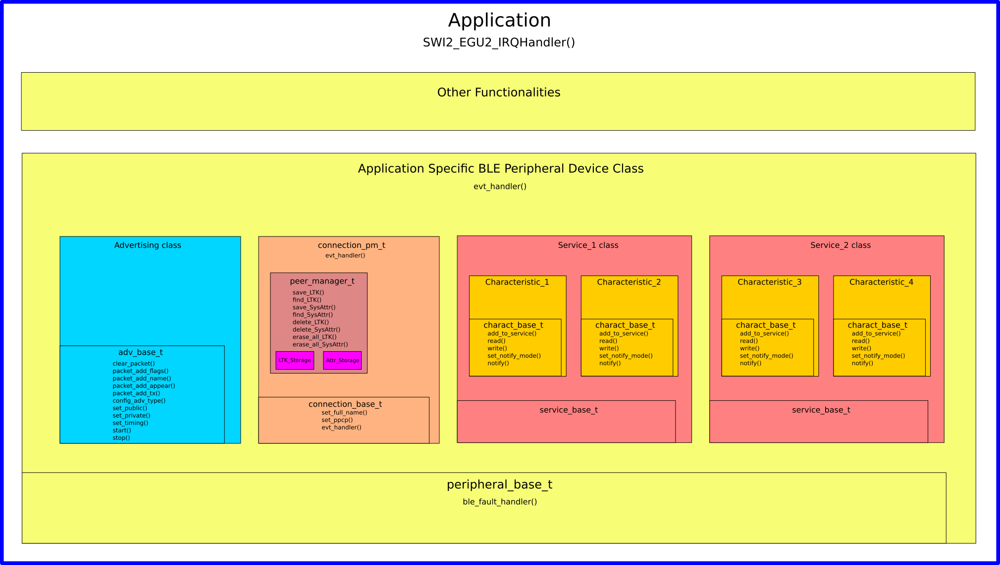

# C++ nRF5 BLE SDK Lite

---

## Introduction

This project aims to provide a light weight, easy to use environment to build a BLE device based on Nordic SoftDevice. The project is written in C++ and will use header files and data structures in SoftDevice and call SoftDevice APIs at bottom level.

Currently, only BLE peripheral device is supported. BLE Central will be added in the future.

By using C++, an application can have a very clear hierarchical structure. For example, a BLE peripheral device is represented by an object of custom BLE peripheral class, which is derived from peripheral_base_t class, and the BLE peripheral class is usually made of an Advertising class, a Connection class and several Service classes etc. ( See the BLE device structure diagram below

User can easily tailor the system to their needs by deriving a new class from the SDK provided base classes,  adding or overriding functions(methods) according to the project needs.

The storage_t class (storage.h) for the saving of the LTKs and System Attributes in bonding process is designed as a virtual base class, so the user can create their own storage class for accessing other memory medias such as EEPROM and external flash etc. to replace the flash_storage_t class defaulted in SDK, which is using the on-chip flash.

This project is created in Segger Embedded Studio, but will be easily ported to other development tool set. Currently all the examples are based on nRF52832 and SoftDevice S132, also it will be easily ported to other chips and SoftDevice versions.

## High Lights

- Pure C++

- Light Weight. The whole SDK for BLE peripheral devices consists of only 8 .cpp files.

- Fully functional. Includes all the functions a typical BLE device will need including bonding, ready for commercial use.

- High efficiency. Code size is only 4.2k for the Blood Pressure example in Release mode (excluding SoftDevice itself).

- Easy to use. Creating BLE device applications in days, not weeks

- Providing 3 download-and-run example projects with 0 or minimum hardware dependency.

## Project Folders

`./lib` class files provided with this SDK, user don't need to modify them usually.

    `./lib/ble` BLE device related files

        `./lib/ble/peripheral/inc`  The header files for the C++ BLE peripheral library, this folder should be added to the "inlcude file search folders" of the IDE.

        `./lib/ble/peripheral/src`  Source files of the C++ BLE peripheral library. cpp files in this folder should be added to the compile list of project.

    `./lib/hw` classes files for on-chip peripherals such as GPIO and RTC used in this SDK

`./SoftDevice`  This folder contains all the SoftDevice files from Nordic. All the examples in this project need only SoftDevice S132, copy the corresponding files in this folder if you need to use other versions of the SoftDevice.

`./examples`  Example projects.

    `./examples/Advertiser` Advertiser example, get chip temperature and broadcasting it as device name.

    `./examples/blinky` Controlling a LED via BLE

    `./examples/blood_pressure` Blood Pressure profile example, updating virtual blood pressure and pulse rate data every second.

`./user`  If you create your own project, it's suggested you put all the user generated files here. The simplest way is to copy an example project to here and modify it according to your needs.

## Getting Started

#### 1. Clone or download SDK to your harddrive

#### 2. Create your own or open an example project with Segger Embedded Studio

Project files have already been created for example project, if you want to create your own project from scratch, please flow the following steps:

1. Open SES, Install nRF CPU Support Package.

2. Create new project, and select "A C/C++ executable for Nordic Semiconductor nRF". 

3. Select target processor, and follow steps to finish project creation.

4. Select your SoftDevice version, read it's release notes, find out how much flash and RAM the SoftDevice will use.

5. Edit ses_nrf52\*.icf file in project folder, modify the definition 
   `define region FLASH = FLASH1;`
   `define region RAM = RAM1;`
   to
   `define region FLASH = FLASH1 - [from 0x0 size 0x26000] - [from 0x7e000 size 0x2000];`
   `define region RAM = RAM1 - [from 0x20000000 size 0x3400];`
   Note: 
   
   - The flash area from 0x0 to 0x26000 above is the space for SoftDevice, 0x26000 is the size of SoftDevice S132 V7.2, for other SofeDevice versions, the size can be found in the corresponding release note. 
   
   - The flash block from 0x7e000 sized 0x2000 is used by the SDK built-in flash storage class for LTK and System Attribute data. This part can be removed if user uses other external storage media or no device bonding is required.
   
   - RAM area from 0x20000000 sized 0x3400 is used by SoftDevice, it needs to be adjusted with different SoftDevice version. In the SoftDevice release note there's a minimum usage of the RAM but in practical the RAM requirement is often significantly larger than it. Since the BLE object is usually defined as global and will be initialized before main(), it's easy to test the RAM size reserved: if code can run to main() when loaded in debugging mode, it means the reserved RAM is sufficient and SoftDevice is running properly. If the code stopped at the infinite while() trap in the device class constructor, it mean the RAM reserved for SoftDevice is too small and you can check the actual needed size in RamStart variable. See peripheral_base.cpp

6. In Project->Options settings, select "Common" in configuration mode, and under "Debug->Loader" item, change the "Additional Load File[0]" item to the selected SoftDevice's hex file.

7. Under "Code->Compiler" item, change C++ Language Standard to "C++11"

8. Under "Code->Preprocessor" item, added `/lib/ble/peripheral/inc`  and other include folders such as SoftDevice include folders in "User Include Directories"

9. If there is a main.c file auto generated, delete it from project and replace with main.cpp

10. Adding all the *.cpp files in the SDK to the project.

## Creating Your BLE Peripheral Device From Scratch

Only 3 steps to create a complete BLE device from scratch, it's so easy to do BLE development with this SDK.

- Step 1: Create Characteristics

- Step 2: Combine Characteristics into Services

- Step 3: Combine Connection, Services and Advertising objects into a BLE device

#### Characteristics

Characteristics is the most basic and important component in a BLE device, all the important features of a device is implemented through a characteristic. For example sending sensor readings to host, or driving a LED according to host commands, all these are done by characteristics.

A customized characteristic is derived from charact_base_t class. User adjust its attributes values to needs in derived class. charact_base_t class is initialized by 3 parameters: **characteristic UUID** , **characteristic meta data**, and **attribute meta data**. Meta data determines the character features, such as whether it's read-only or writable, whether it's able to send notifications or indications to host etc.

Both characteristic meta data and attribute meta data have default values, so for simple applications, only the UUID is needed to initialize the characteristic. UUIDs can be full 128bit or 16bit, please refer the Blinky example to find out how to use a 128bit UUID. The default settings for characteristic are:

- read and writable

- able to send notifications

- no authorization requirement for reading and writing (non-encrypted link)

All the default values used by this SDK are in a single file `param_const.h` located in `./lib/ble/peripheral/inc` 

#### Services

A service is simply an integration of several characteristics. What you need to do is inherit from service_base_t class and add characteristics that belongs to this service as its public members. A service will also need a UUID to initialize.

#### Connections

A connection class is an abstraction of all the communication related functionalities, for an application, the most important property is the event handler. All the BLE related events are handled by the connection class, that includes such as "Connection Request", "Connected", "Disconnected", "Bonding(pairing)", "Characteristic Value Writing" etc.

All the fundamental events have already been handled by the SDK base class, normally user doesn't need to create any derived class from the base connection class. 

There are 2 base classes provided by the SDK, connection_base_t and connection_pm_t, connection_pm_t is derived from connection_base_t with Peer_Manager class as a member, therefore is suitable for BLE devices which needs bonding (pairing) features.

#### Peer Manager

peer_manager_t is a class purposed for saving and restoring the peer data. The peer data includes LTK and System Attribute data. These data are used to reestablish connections between bonded devices after bonding(pairing) and disconnection. 

LTK and System Attribute data have different updating frequency, LTK will remain unchanged until the bonded relation has been deleted, while the System Attribute data needs to be updated each time the connection is disconnected. So the Peer Manager uses 2 storage classes for LTK and Attribute data saving.

The SDK provides flash_storage_t class as default storage, it uses internal flash memory as storage media. In the examples, flash_storage_t will be used for both LTK and System Attribute storage. User can create their own storage class, which should be derived from the storage_t class.

## Examples

This SDK comes with 3 example projects, users can build their own projects based on these examples. The projects are made as much independent to hardware as possible, so it can be run on a wide range of hardware. The only project that has hardware dependency is the Blinky project. The examples are:

- Advertiser
  
  It is a broadcast(advertising) only application, the device will read it's internal temperature sensor and put the result in the advertised device name. User even don't need a BLE App to read the output, using a mobile phone to search for Bluetooth devices is all that needed. (But it's recommended to use a BLE scan App so the reading can be refreshed automatically.)

- Blinky
  
  Controlling a LED connected to P0.17 from the host(mobile phone). User can use nRFConnect or a similar BLE testing App to control the LED, just write 0 or 1 as uint_8 data to the characteristic.

- Blood_Pressure
  
  The Blood Pressure app is compliant with Bluetooth SIG's Blood Pressure Profile specification and has 2 characteristic included: Blood Pressure Measurement and Blood Pressure Features. The blood pressure reading is not real but simulated so no real measuring circuit is needed to run this example. The Blood Pressure Features characteristic shows the device features and is required by the profile specification. This Blood Pressure example should work with any mobile Apps that is compliant with the standard BLE Blood Pressure Profile.
